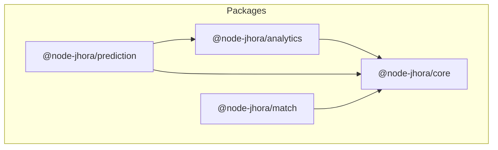

# Architecture Overview

Node-Jhora is architected as a **Tiered Monorepo**. This structure allows for a clean separation between raw astronomical calculations, high-level astrological analytics, and predictive logic.

## Monorepo Structure

The project uses NPM Workspaces and is split into four primary packages:

### 📦 `@node-jhora/core`
The foundation of the engine.
- **Astronomy**: WASM-based Swiss Ephemeris.
- **Math**: Spherical geometry and normalization utilities.
- **Vedic Fundamentals**: Panchanga logic, divisional chart (Varga) math, and basic house systems.
- **Data**: Geocoding and city lookup streams.

### 📦 `@node-jhora/analytics`
The engine for depth and strength.
- **Shadbala**: Complete implementation of the 6-fold planetary strength system.
- **Ashtakavarga**: BAV and SAV score calculation.
- **Yoga Engine**: A rule-based engine for detecting planetary combinations.

### 📦 `@node-jhora/prediction`
Dynamic time-based logic.
- **Dashas**: Multiple systems including Vimshottari (recursive), Yogini, and Narayana.
- **Transits**: Event-based scanners for planet ingresses and aspects.
- **Jaimini**: Chara Karakas, Arudhas, and related predictive math.

### 📦 `@node-jhora/match`
Specialized compatibility logic.
- **Porutham**: Implementation of 10/12 Kuta systems for marriage compatibility.

---

## Design Principles

1.  **Pure ESM**: All packages are strictly ESM to leverage modern tree-shaking and module resolution.
2.  **Stateless Logic**: Most calculation functions are pure, taking a state (like `ChartData`) and returning results.
3.  **High-Precision**: All calculations use `double` precision (via WASM) and handle angular normalization (0-360) rigorously.
4.  **Extensible Yogas**: The Yoga engine uses a JSON-compatible rule definition, allowing developers to add custom Yogas without changing core engine code.

## Build System
The monorepo uses **TypeScript Project References**.
- **`composite: true`**: Enables incremental builds across packages.
- **References**: Each package's `tsconfig.json` explicitly references its dependencies, allowing `tsc -b` to build only what's necessary in the correct order.
