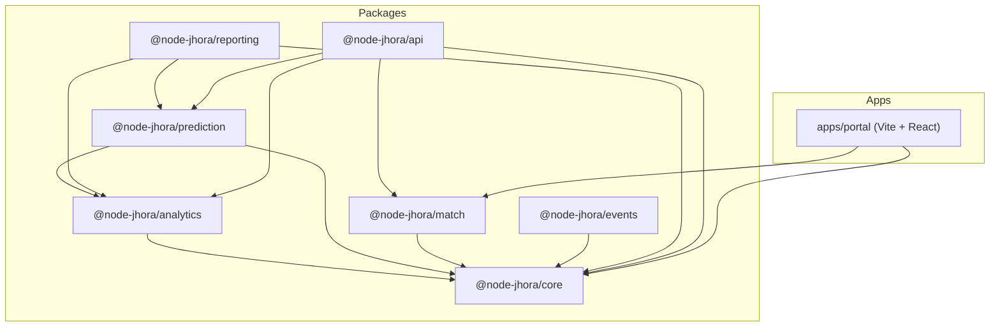

# Architecture Overview

Node-Jhora is architected as a **Tiered Monorepo**. This structure allows for a clean separation between raw astronomical calculations, high-level astrological analytics, predictive logic, compatibility matching, event detection, reporting, and API exposure.

## Monorepo Structure

The project uses NPM Workspaces and is split into seven specialized packages plus a demo application:



---

### 📦 `@node-jhora/core`
The foundation of the engine.
- **Astronomy**: WASM-based Swiss Ephemeris with topocentric parallax correction.
- **Math**: Spherical geometry, angular normalization, and `Decimal.js` precision utilities.
- **Vedic Fundamentals**: Panchanga (5 limbs), all 16 divisional charts (Vargas D1–D60), and house systems (Whole Sign, Placidus, Porphyry).
- **Special Lagnas**: Pranapada, Indu Lagna, Hora Lagna, Ghati Lagna, Bhava Lagna, Varnada Lagna.
- **Upagrahas**: Gulikadi (time-based) and Dhumadi (angular) sub-planetary points.
- **KP System**: Sub-lord tables and Ruling Planets calculation.
- **Streaming**: Real-time `PlanetaryStream` for live planetary updates.
- **Data**: Geocoder with local CSV city database for coordinates and timezones.
- **Facade**: `NodeJHora` class with static `calculate()` and instance methods for ergonomic usage.

### 📦 `@node-jhora/analytics`
The engine for depth and strength.
- **Shadbala**: Complete implementation of the 6-fold planetary strength system (Sthana, Dig, Kaala, Chesta, Naisargika, Drig Bala).
- **Ashtakavarga**: Bhinnashtakavarga (BAV) and Sarvashtakavarga (SAV) score calculation.
- **Yoga Engine**: Rule-based engine for detecting hundreds of planetary Yogas with JSON-compatible definitions.
- **KP Engine**: Extended KP significator calculations (`KPPlanetSignificator`, `KPHouseSignificator`).

### 📦 `@node-jhora/prediction`
Dynamic time-based predictive logic.
- **Dashas**: Multiple systems including Vimshottari (5-level recursive), Yogini (8-year cycles), and Narayana (Rashi-based).
- **Transits**: Event-based scanners for planet ingresses and aspects using Newton-Raphson refinement.
- **Jaimini**: `JaiminiCore` for Chara Karakas (7-karaka system) and Arudha Padas, `JaiminiDashas` for Chara Dasha timing.

### 📦 `@node-jhora/match`
Comprehensive compatibility and dosha analysis.
- **Ashta Kuta (North Indian)**: Full 8-point system (Varna, Vashya, Tara, Yoni, Graha Maitri, Gana, Bhakoot, Nadi) with 36-point scoring.
- **Dasha Kuta (South Indian)**: 10 Poruthams with Vedha pair analysis, Rajju dosha check, and mandatory rules.
- **Mangal Dosha**: Mars-position analysis from Lagna, Moon, and Venus with exception handling (own house, exalted).

### 📦 `@node-jhora/events`
Precision astronomical event detection.
- **TransitScanner**: Generic binary-search solver for finding exact moments when conditions change.
- **Ingress Detection**: `findIngress()` and `findNextIngress()` for sign boundary crossings.
- **Stationary Points**: `findStationaryPoint()` for retrograde/direct station detection.

### 📦 `@node-jhora/reporting`
PDF report generation for professional output.
- **Full Reports**: Complete birth chart PDF with planetary positions, house cusps, Yogas, and Shadbala.
- **Chart Drawing**: `ChartDrawer` for rendering North/South Indian chart diagrams.
- **Output**: Returns a `Buffer` suitable for file saving or HTTP responses.

### 📦 `@node-jhora/api`
Production-ready REST API layer.
- **Framework**: Fastify with Zod type-provider for compile-time safe schemas.
- **Validation**: Zod schemas for all birth input parameters (datetime, coordinates, ayanamsa, house system).
- **Routes**: `/v1/chart`, `/v1/chart/vargas`, `/v1/panchanga`, `/v1/dasha`, `/v1/shadbala`, `/v1/kp`, `/v1/match`.
- **Logging**: Structured logging via Pino with pretty-print in development.
- **CORS**: Configurable cross-origin support via environment variables.

### 🖥️ `apps/portal`
Demo application (React + Vite).
- Interactive Vedic astrology portal using `@node-jhora/core` and `@node-jhora/match`.
- WASM support via `vite-plugin-wasm` and `vite-plugin-top-level-await`.

---

## Design Principles

1.  **Pure ESM**: All packages are strictly ESM (`"type": "module"`) to leverage modern tree-shaking and module resolution.
2.  **Stateless Logic**: Most calculation functions are pure, taking a state (like `ChartData`) and returning results.
3.  **High-Precision**: Core calculations use `Decimal.js` to eliminate floating-point drift. WASM provides Swiss Ephemeris accuracy (0.0001″).
4.  **Extensible Yogas**: The Yoga engine uses a JSON-compatible rule definition (`YogaDef`), allowing developers to add custom Yogas without changing engine code.
5.  **Tiered Dependencies**: Each package has a clear dependency scope — import only what you need, nothing more.

## Build System

The monorepo uses **TypeScript Project References**.
- **`composite: true`**: Enables incremental builds across packages.
- **References**: Each package's `tsconfig.json` explicitly references its dependencies, allowing `tsc -b` to build only what's necessary in the correct order.
- **Output**: Each package compiles to its own `dist/` directory.

## Testing

Jest 30 with `ts-jest` ESM preset. The `moduleNameMapper` strips `.js` extensions for ESM resolution. Tests live in `packages/<name>/tests/` as `*.test.ts`.

## ESM Import Convention

All internal imports use `.js` extensions even for TypeScript source files (NodeNext resolution):
```typescript
import { normalize } from './math.js'; // Not ./math.ts
```
